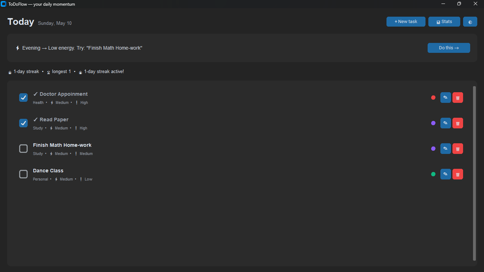
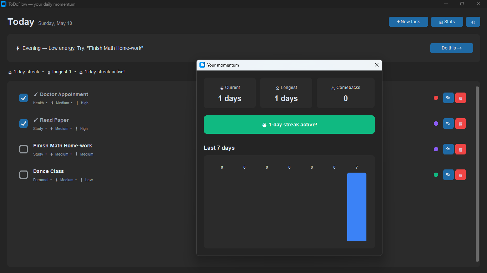
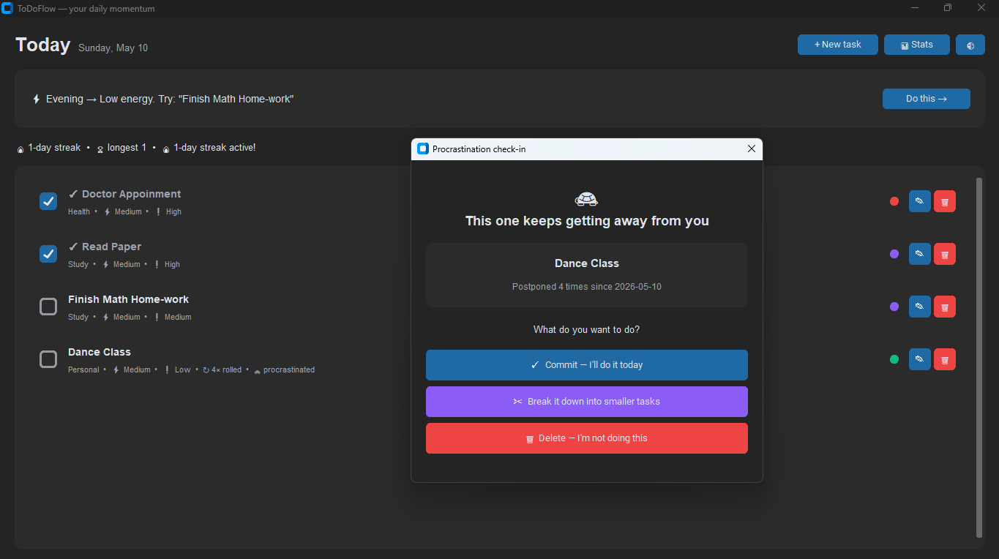

<div align="center">

# 🌊 ToDoFlow

**A Python desktop to-do app that fights procrastination with auto-rollover, energy-based scheduling, and streak tracking.**


[Features](#-features) • [Demo](#-demo) • [Install](#-installation) • [How it works](#-how-it-works) • [Roadmap](#-roadmap)

</div>


## 💡 Why I built this

I kept making to-do lists in random apps and notebooks, but the same problem showed up every time: I'd skip tasks, leave them for "tomorrow," and lose track of what mattered. Standard to-do apps don't help with this — they just let you postpone things forever.

ToDoFlow is built around three ideas to fix that:

1. **Postponing should have a cost.** Every rollover is tracked, and after 3, you get a check-in.
2. **Match work to energy.** A heavy task at 9 PM is doomed. The app suggests what to do based on the time of day.
3. **Momentum is motivating.** A streak counter and weekly chart keep you showing up.

## 📸 Demo







## ✨ Features

### 🔄 Auto-rollover with guilt tracking
Skip a task today? It rolls forward to tomorrow automatically — but the app counts how many times you've postponed it. After 3+ rollovers, the task is flagged as "procrastinated" and you're prompted to either **commit**, **break it down** into smaller subtasks, or **delete it**.

### ⚡ Energy-based scheduling
Tag every task with the energy level it requires (High / Medium / Low). The app reads the time of day and suggests what to work on right now:

| Time | Energy window | Best for |
|------|--------------|----------|
| Morning (5am – noon) | **High** | Deep work, hard problems |
| Afternoon (noon – 5pm) | **Medium** | Admin, meetings, errands |
| Evening (5pm – 10pm) | **Low** | Planning, light tasks |
| Night (10pm – 5am) | **Low** | Wind down, reading |

### 🔥 Streak & momentum system
Daily streak, longest streak, comeback counter (for when you fall off and start again), and a weekly bar chart of completed tasks.

### 🏷️ Categories with colors
Pre-seeded with Work, Personal, Study, Health, Other — fully editable with custom colors.

### 🔔 Desktop notifications
Native OS notifications for rollovers, procrastinated tasks, and at-risk streaks.

### 🌓 Light & dark mode toggle

## 🛠️ Tech stack

- **Python 3.10+**
- **CustomTkinter** — modern themed GUI
- **SQLite** — embedded database (no setup required)
- **plyer** — cross-platform desktop notifications

## 📦 Installation

### Option 1: Run from source

```bash
git clone https://github.com/ZikraAK/todoflow.git
cd todoflow
pip install -r requirements.txt
python main.py
```

### Option 2: Standalone executable (Windows / Mac)

Download the latest `.exe` or `.app` from the [Releases page](../../releases). No Python installation needed.

## 🗂️ Project structure

```
todoflow/
├── main.py                           # entry point
├── database.py                       # SQLite handler + schema
├── requirements.txt
├── logic/
│   ├── rollover.py                   # auto-rollover + guilt tracking
│   ├── energy.py                     # time-of-day → energy mapping
│   ├── streaks.py                    # streak calculation
│   └── notifications.py              # desktop notifications
└── ui/
    ├── main_window.py                # main app window
    ├── task_dialog.py                # add/edit task modal
    ├── stats_window.py               # streaks + weekly chart
    └── procrastination_dialog.py     # commit / break-down / delete
```

## 🧠 How it works

### Database schema

Six SQLite tables drive the app:

- `categories` — Work / Personal / Study, with colors
- `tasks` — title, description, category, energy, priority, deadline, rollover count, status
- `rollover_log` — every rollover gets a row (full procrastination history)
- `completion_log` — every completion logged with date (powers streaks)
- `daily_stats` — pre-aggregated daily numbers for fast charts
- `streaks` — current streak, longest, comeback counter

### The rollover engine

On every app launch:

1. Find all pending tasks where `due_date < today`.
2. For each, write a row to `rollover_log`, increment `rollover_count`, set `due_date = today`.
3. If `rollover_count >= 3`, flag `is_procrastinated = 1` — the UI prompts the user to handle it.

### The streak engine

Whenever a task is completed:

- If `last_active_date` is today → no change (already counted).
- If `last_active_date` was yesterday → streak + 1.
- If gap is 2+ days → streak resets to 1, comeback counter incremented.

## 🗺️ Roadmap

- [ ] Calendar date picker (replace text input)
- [ ] Pomodoro timer integration per task
- [ ] Recurring tasks (daily / weekly habits)
- [ ] End-of-day reflection prompts
- [ ] CSV export for pattern analysis
- [ ] Cloud sync option

## 🤝 Contributing

PRs and feature suggestions welcome! Open an issue first to discuss bigger changes.

## 📄 License

MIT — feel free to use, modify, and share.

---

<div align="center">
Made with ☕ and a lot of postponed tasks.
</div>
